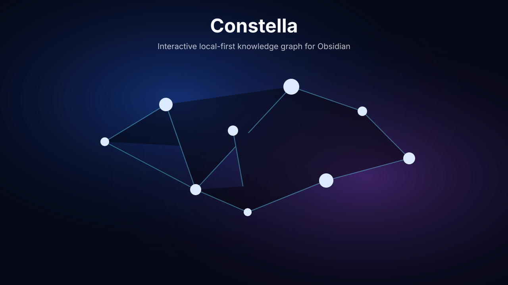

# Constella for Obsidian

**Your vault in motion.**

Explore your vault as an interactive, local-first knowledge graph. Turn notes into nodes and links into connections, navigate manually or auto-travel, detect clusters, save visual templates and playlists, and open graphs fullscreen or in a pop-out display window - all read-only and local.

Constella is read-only and local. It reads vault metadata to render the graph, but it does not modify notes and does not send data anywhere.



## Installation

### Manual Installation

1. Build the plugin:

   ```bash
   npm install
   npm run build
   ```

2. In your Obsidian vault, create this folder:

   ```text
   .obsidian/plugins/constella
   ```

3. Copy these files into that folder:

   ```text
   main.js
   manifest.json
   styles.css
   ```

4. Open Obsidian.
5. Go to `Settings` -> `Community plugins`.
6. Turn off `Restricted mode` if needed.
7. Click `Reload plugins`.
8. Find `Constella` in the installed plugins list.
9. Enable Constella.

### Development Installation

For development, you can symlink this project folder into a vault:

```bash
ln -s "/path/to/constella" "/path/to/your/vault/.obsidian/plugins/constella"
```

Then build:

```bash
npm run build
```

For automatic rebuilds while developing:

```bash
npm run dev
```

## Opening Constella

You can open Constella in several ways:

- Click the ribbon icon in Obsidian.
- Run `Constella: Open` from the Command Palette.
- Click `Constella` in the status bar.

On first launch, Constella shows a short onboarding panel with quick choices such as `Start Cinematic`, `Start Constellation`, `Open Playground`, and `Skip`.

## How It Works

Constella reads Markdown files and resolved links from Obsidian's public metadata APIs. It then builds its own graph:

- Each note becomes a node.
- Each resolved link becomes an edge.
- Recent notes, forgotten notes, hubs, and hidden gems are calculated locally.
- Clusters are detected using a label-propagation algorithm.
- The graph is rendered with Canvas instead of relying on private Obsidian Graph internals.

Constella is read-only. Double-clicking a node opens the note, but the plugin does not automatically edit note content.

## Core Concepts

Constella keeps these systems separate:

- **Mode** decides what Constella does, such as `Wander`, `Path Journey`, `Recent Activity`, or `Forgotten Knowledge`.
- **Visual** decides how the graph is drawn, such as `Minimal`, `Constellation`, `Deep Space`, `Neon`, or `Soft Glow`.
- **Colors** decides color behavior, such as `Aurora`, `Rainbow Flow`, `Deep Ocean`, `Forest`, or `Cluster Based`.
- **Camera** decides how the view moves, such as `Static`, `Calm`, `Floating`, `Cinematic`, or `Dynamic`.
- **Template** is a saved combination of Mode, Visual, Colors, Camera, and other settings.
- **Playlist** is a sequence of steps that can switch modes, visuals, colors, and camera profiles over time.

## Highlights

- Search and focus notes directly from the Constella control panel.
- Reset the graph to all Markdown notes with `Show All Notes`.
- Filter the graph by folder, tag, recent notes, forgotten notes, and minimum link count.
- Keep floating/orphan notes visible in local graph views.
- Hover a node to highlight its direct neighbors.
- Pin nodes, temporarily hide nodes or clusters, expand from a selected note, and preview a path between two notes.
- Tune background intensity, label size, node size, edge thickness, particles, pulses, drawing lines, visual styles, and reduce-motion mode.
- Show an optional legend for color modes such as Heatmap, Age Gradient, Cluster Neon, Focus Fade, and Signal Strength.
- Show an optional FPS indicator for performance checks.

Templates are never overwritten automatically. If you change settings after loading a template, the current setup becomes `Modified` until you explicitly choose Save or Save As.

## Controls

### Quick Bar

The Quick Bar appears at the bottom of the Constella view. It lets you quickly:

- start, pause, and stop;
- switch between Global, Local, and Current Note graph scopes;
- choose Mode, Visual, Colors, and Camera;
- adjust speed and intensity;
- randomize the current setup;
- save the current setup;
- export the current graph as a PNG;
- open fullscreen or a second-screen pop-out;
- open the Control Panel.

The Quick Bar can also be collapsed into a compact icon.

### Control Panel

The Control Panel includes sections for:

- Quick
- Templates
- Graph
- Visual
- Background
- Motion
- Paths
- Journey
- Discovery
- Display
- Advanced

Most visual settings are applied live, including colors, intensity, camera behavior, node movement, glow, particles, connection pulses, drawing lines, labels, and background style.

### Keyboard Controls

Inside the Constella view:

- `Space`: start or pause
- `Arrow Left`: previous journey node
- `Arrow Right`: next journey node
- `Enter`: open the selected node
- `Escape`: stop

### Node Interaction

- Click a node to select it.
- Hover a node to highlight its immediate neighbors.
- Double-click a node to open the note.
- Use `Pin Focused Node` to keep a selected node still while the graph moves.
- Use `Hide Node` or `Hide Cluster` for temporary decluttering.
- Use `Expand From Node` to show only the focused note and its direct neighbors.
- Use `Set Path Start`, then select another node to preview a route between them.
- Right-click a Markdown file in Obsidian and choose `Start Constella Journey from this note`.

## Graph Scopes

Constella supports:

- `Global`: the full vault graph.
- `Local`: the graph around the current note, with configurable depth up to 50 link steps.
- `Current Note`: a focused graph for the active note.

Floating notes are Markdown notes without resolved links. The `Include Floating Notes` option keeps them visible in local graph scopes and places them on an outer ring for easier scanning.

## Journey Modes

Available modes:

- `Wander`
- `Path Journey`
- `Recent Activity`
- `Forgotten Knowledge`
- `Hub Explorer`
- `Hidden Gems`
- `Cluster Journey`
- `Random Discovery`

The journey engine follows real relationships in your vault and can prefer recent notes, old notes, hubs, hidden gems, or random discoveries.

## Templates

## Visual Styles

Constella includes a broad visual-style library. Each style changes how nodes and edges are rendered, not just the color palette.

Built-in visual styles:

- Minimal
- Constellation
- Deep Space
- Neon
- Soft Glow
- Clean
- Star Chart
- Galaxy Spiral
- Matrix Grid
- Blueprint Lines
- Orbital Rings
- City Network
- Data Stream
- Heatmap Cloud
- Paper Map
- Library Index
- Zen Stones
- Crystal Lattice
- Solar Orbits
- Terminal Blocks
- Red Scanner
- Ocean Bubbles
- Prism Shards
- Radar Sweep
- Topographic
- Circuit Board

## Camera Motion

Constella includes camera motion styles for different exploration moods and screen setups:

- Static
- Calm
- Floating
- Cinematic
- Dynamic
- Fast
- Focus Lock
- Slow Drift
- Wide Orbit
- Close Orbit
- Breathing Zoom
- Presenter Pan
- Scanline
- Radar Orbit
- City Cruise
- Data Chase
- Cluster Hop
- Edge Glide
- Constellation Tour
- Zen Still
- Paper Follow
- Matrix Rush
- Galaxy Dive
- Micro Wander
- Overview Pulse
- Second Screen Calm

## Templates

Constella includes built-in templates such as:

- Calm
- Cinematic
- Constellation
- Neon
- Discovery
- Minimal Dark
- Minimal Light
- Minimal Focus
- Quiet Map
- Paper Notes
- Ink Map
- Clean Clusters
- Matrix Hacker
- Orbital Drift
- Swarm Field
- Signal Chaos
- Breathing Graph
- City Lights
- Zen Garden
- Blueprint
- Solar System
- Library Night
- Crystal
- Terminal Amber
- Red Alert
- Ocean Depths
- Paper Minimal
- Galaxy Core
- Heatmap
- Age Gradient
- Cluster Neon
- Focus Fade
- Signal Strength
- Night Vision
- Archive Dust
- Prism Flow
- Constellation White
- Infrared

Templates can be:

- applied;
- saved;
- saved as a new template;
- duplicated;
- edited;
- deleted if they are custom templates.

Built-in templates are protected. They cannot be deleted or overwritten directly.

## Playlists

A playlist is made of multiple steps. Each step can define:

- Mode
- Visual
- Colors
- Camera
- Duration
- Transition

The built-in `Evening Flow` playlist demonstrates this system. You can create a playlist from the current setup and edit existing playlists in the playlist editor.

## Import and Export

Constella can export and import templates and playlists as JSON. It can also export the current graph view as a PNG image from the Quick Bar or Command Palette.

Relevant commands:

- `Constella: Export Templates and Playlists`
- `Constella: Import Templates and Playlists`
- `Constella: Export Graph as PNG`

The exported JSON contains Constella settings only. It does not include note content.

## Screensaver and Display Mode

Constella includes commands for:

- fullscreen screensaver;
- display mode;
- hiding Obsidian UI;
- opening a pop-out window for second-screen use.

Use `Constella: Open Display Window` to open Constella in an Obsidian pop-out window. You can then move that window to another monitor.

Constella uses Obsidian's official pop-out window workflow instead of controlling Electron windows directly. This is safer for community plugin compatibility.

## Command Palette

Useful commands:

- `Constella: Open`
- `Constella: Start`
- `Constella: Pause`
- `Constella: Stop`
- `Constella: Toggle`
- `Constella: Open Controls`
- `Constella: Open Playground`
- `Constella: Open Templates`
- `Constella: Edit Active Template`
- `Constella: Edit Playlist`
- `Constella: Start Path Journey`
- `Constella: Start Wander`
- `Constella: Start Playlist`
- `Constella: Start Screensaver`
- `Constella: Start Display Mode`
- `Constella: Open Display Window`
- `Constella: Randomize`
- `Constella: Save Current Setup`
- `Constella: Focus Current Note`
- `Constella: Toggle Fullscreen`
- `Constella: Export Graph as PNG`
- `Constella: Export Templates and Playlists`
- `Constella: Import Templates and Playlists`

## Development

Project structure:

```text
src/
  core/
  graph/
  discovery/
  path/
  templates/
  playlists/
  screensaver/
  display/
  performance/
  settings/
  ui/
```

Useful scripts:

```bash
npm install
npm run build
npm run dev
npm run typecheck
```

The build creates `main.js`, which Obsidian loads together with `manifest.json` and `styles.css`.

## Releasing

Constella versions should be bumped in `manifest.json`, `package.json`, `package-lock.json`, and `versions.json`.

Obsidian expects the GitHub release tag to match the manifest version exactly, without a leading `v`. For example, release tag `0.2.0` matches manifest version `0.2.0`.

The GitHub Actions workflow builds the plugin and uploads these release assets for version tags:

```text
main.js
manifest.json
styles.css
```

See [CHANGELOG.md](CHANGELOG.md) for release notes.

## Privacy

Constella:

- works locally;
- uses no telemetry;
- uses no analytics;
- uploads no vault data;
- does not automatically modify notes;
- uses no external API.

## Current Limitations

- The renderer is Canvas-based. This is intentional for stability and low dependency weight.
- Native Obsidian Graph internals are not used. A graph adapter boundary exists for future experiments.
- Display mode uses Obsidian's official pop-out window workflow instead of private Electron window control.
- Import/export currently works through a JSON dialog. A file picker flow can be added later.
- Full gallery-style manager views for templates, playlists, and palettes are still future polish.

## Status

The plugin builds successfully with:

```bash
npm run build
```

The current implementation includes the graph view, search, filters, hover highlighting, pin/hide/expand/path-preview interactions, journeys, templates, playlists, discovery, clustering, visual effects, import/export, screensaver/display commands, and read-only vault behavior.
